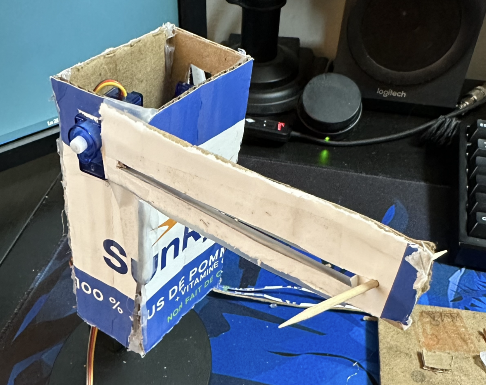
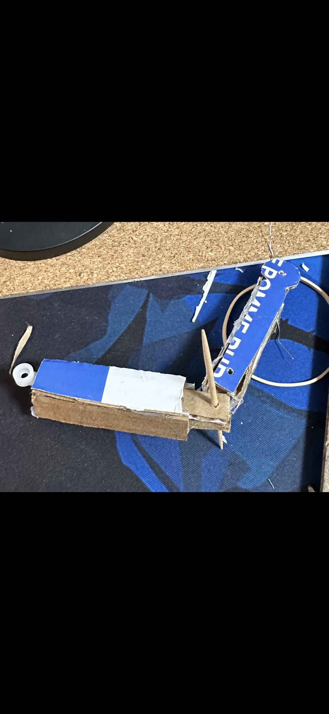
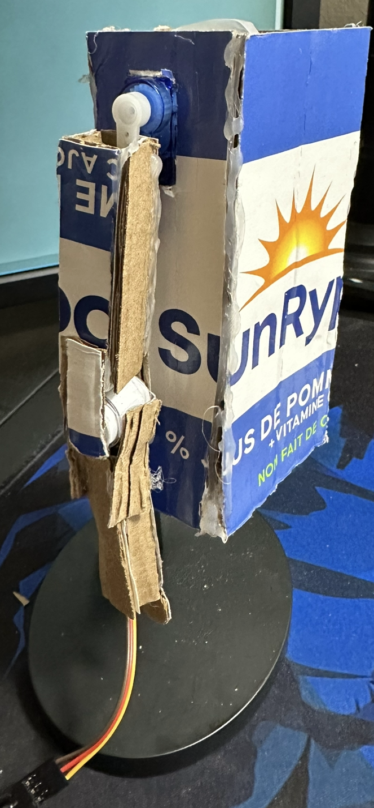
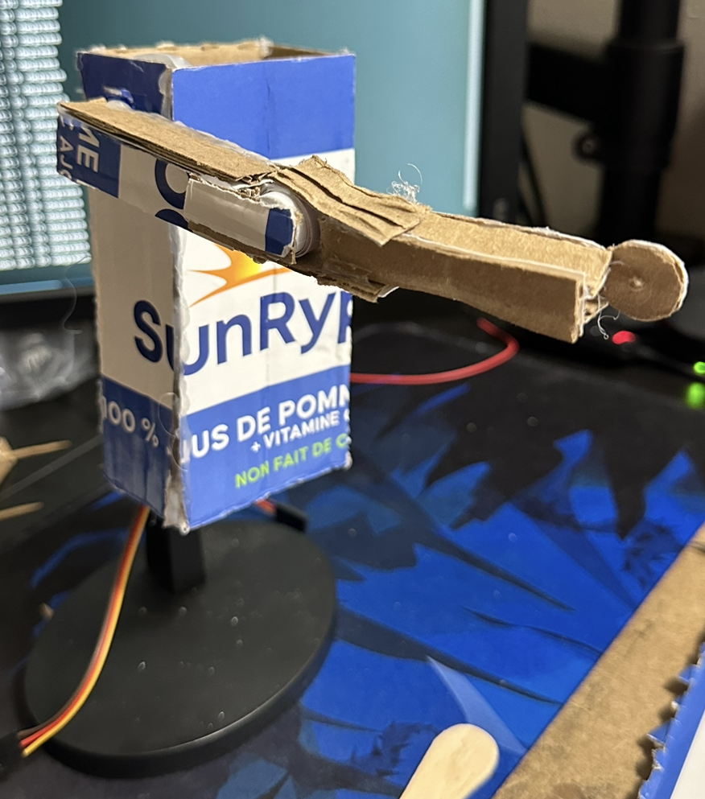
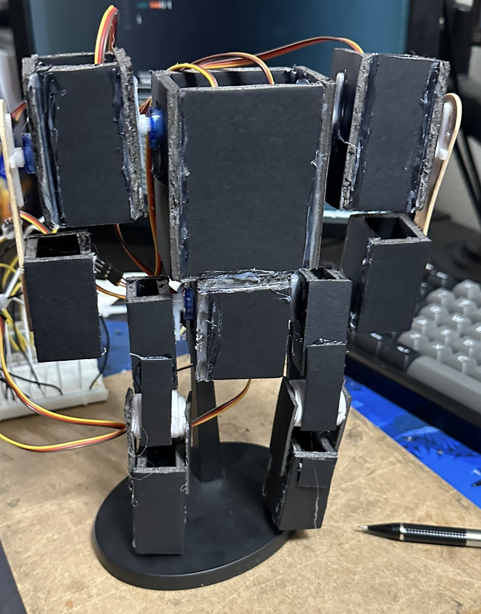
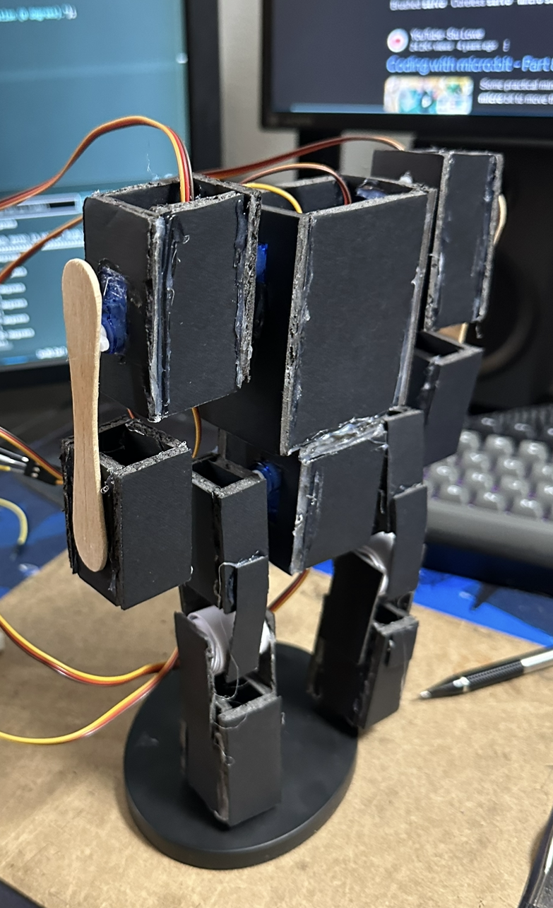
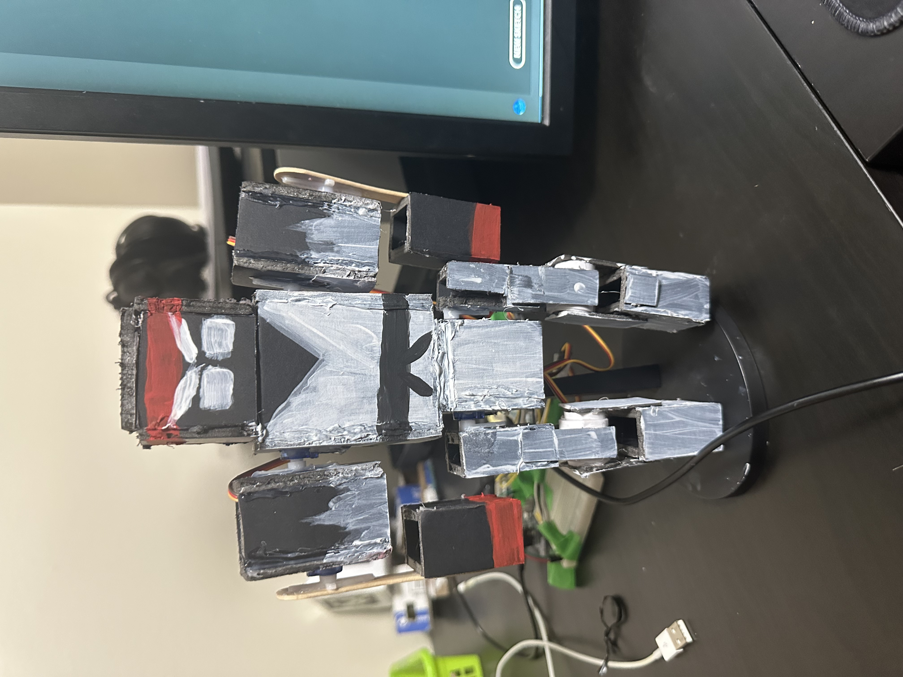
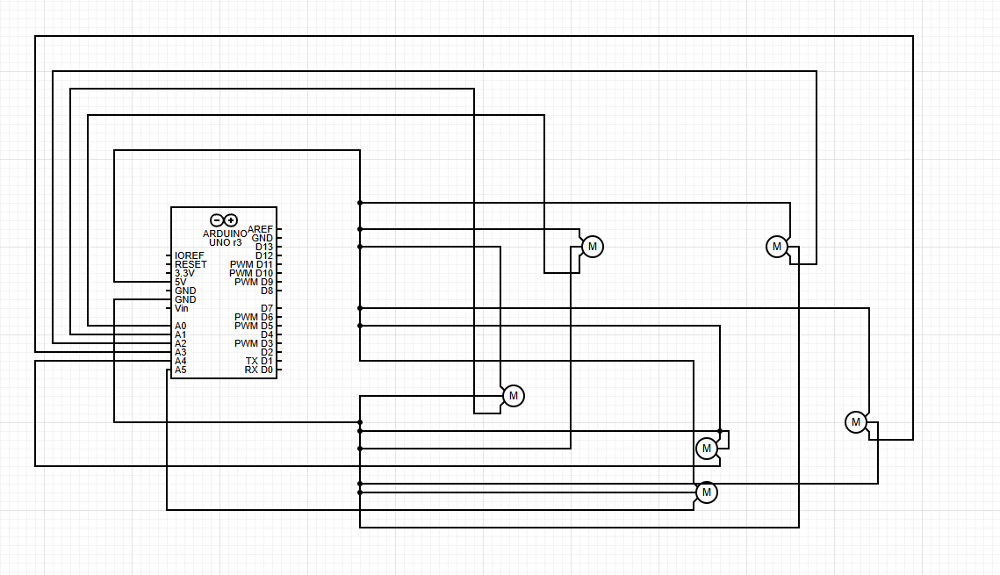

# Mental Fighter 

### [link to Arduino code](https://github.com/AmanH41/CPSC599A3DOC/blob/cc9605b9d78068a5d29ef69d67d70569dc6ad710/A3.ino)
### [link to python code](https://github.com/AmanH41/CPSC599A3DOC/blob/cc9605b9d78068a5d29ef69d67d70569dc6ad710/599A3payerData.py)

## Overall Description
A mental Fighter is a physical representation of a fighting game player’s “mental”—the complex series of thoughts and emotions (joy, anger, frustration, confusion, etc.) that players experience as they progress through rounds and matches. Mental Fighter visualizes these mental states, providing players with feedback on their emotional and psychological condition throughout gameplay.

A common question might be, “Why would competitive players need visual feedback about their feelings?” Competitive players are often driven to keep playing regardless of frustration, anger, or other negative emotions that arise during a session. Ignoring these feelings can impact decision-making, mechanical skills, and mental health.

Mental Fighter offers a solution by showing players their “mental” state after each match. This reflection allows them to assess whether they should continue playing or take a short break to reset and improve their mindset.
## Project Documentation 
### How Does it Work?

1. **Win/Loss Tracking and Action Mapping:**  
Mental Fighter monitors the player’s wins and losses. Each outcome triggers a specific action: winning a match prompts Mental Fighter to perform a punch or power-up motion while losing a match triggers a blocking action. This approach reflects the player’s in-game performance through physical actions, allowing them to see their “mental state” unfold as the game progresses.

2. **Real-Time Physical Feedback:**  
As the player wins or loses consecutive games, Mental Fighter responds with different physical movements. For example, a winning streak prompts it to “power up,” representing momentum and confidence, while losing too many games in a row causes Mental Fighter to curl into a fetal position, indicating mental strain. These physical reactions occur in real-time, giving players immediate, tangible feedback that mirrors their in-game experiences.

3. **Reflection and Mandatory Breaks:**  
After each match, players can assess their Mental Fighter’s condition and decide whether to continue or take a break. However, when Mental Fighter reaches the fetal position (a “superblock” state) due to excessive losses, the system enforces a 5-minute break. During this time, Mental Fighter remains in the fetal position, signaling the need for a mental reset. Once the 5-minute timer ends, it returns to an idle state, allowing the player to resume gameplay.

## Initial ideas

    
   
    
   
 Initially, my ideas centered around creating a figure that would move based on some form of data—though I wasn't sure at the time what that data would represent. Other concepts included a physical representation of a person’s mental state, embodied by a “brain” that would animate, and a robot with hotspots around its body that would move or glow in response to data inputs.

As I refined these ideas, I focused more on concepts inspired by my passion for fighting games and competitive spirit. This led me to develop ideas that capture that drive, translating the emotional and mental intensity of gameplay into physical actions and expressions.

## Upgrade ideas

    
    
   
 When brainstorming iteration ideas for Mental Stack, most concepts leaned more toward software than hardware. In my view, the embodiment I had built didn’t require significant upgrades but could have benefited from enhancements like adding lights or possibly upgrading the material to a 3D-printed body. The layout of Mental Fighter worked well and didn’t require any dramatic changes. The major improvements I envisioned included game integration, where Mental Fighter would respond autonomously to in-game data rather than relying on manual win/loss inputs, and adding sound effects to accompany the animations. 

## Prototypes 

  
  
  
  
  

These early prototypes explored using a single servo to control the entire arm for punch and block actions. Initially, controlling the shoulder/upper arm was straightforward, but getting the forearm to move smoothly was challenging. I rigged a mechanism to keep the fist vertical relative to the shoulder, allowing it to transition easily between punch and block positions. However, the main issue was friction: as the arm moved horizontally, it often got caught on the edges of the cardboard base due to the angle and stability of the structure.

To reduce friction, I added tape, which helped when moving the arm manually. However, the servo motor couldn’t push and pull the arm effectively, as the structure’s alignment wasn’t precise enough, causing it to snag at certain points. The second prototype was essentially a 3D version of the first, which I hoped would have greater structural integrity. However, testing revealed similar issues with friction and alignment, preventing smooth movement.

  
  
  
  
  
The third prototype served as a precursor to the final version. In this iteration, I decided to add an internal servo specifically for moving the forearm, which allowed for greater control of the entire arm and provided additional options for expressive actions.

For the final version, I further enhanced the design by adding legs, as the torso alone felt incomplete. The legs now contribute to the “block” and “super block” animations, creating a more dynamic range of expressions and enabling potential future features, like kicks. With a more humanoid figure in place, I also added a head to complete the design and give Mental Fighter a fully rounded appearance.

## Final Version

For A3, the main improvement involved giving Mental Fighter a new paint job to make it resemble a fighting game character, specifically Ryu from Street Fighter. This change was intended to enhance the character's robustness and align its design    
with the project's story. 

### Circuit Schematic Diagram

  

### Demo Video [link to video](https://youtu.be/mXJikWVIHtw)

  <iframe 
    width="60%" 
    height="60%" 
    src="https://www.youtube.com/embed/mXJikWVIHtw" 
    title="YouTube video player" 
    frameborder="0" 
    allow="accelerometer; autoplay; clipboard-write; encrypted-media; gyroscope; picture-in-picture" 
    allowfullscreen>
  </iframe>

## Refrence 
<a href="https://docs.arduino.cc/learn/electronics/servo-motors/">Guide for servo motors </a> 
<a href="https://www.youtube.com/watch?v=tF3-zdU4qhw&ab_channel=TD_Sculptures%26Crafts">tutorial helped with building mental fighters body </a> 
<a href="https://www.youtube.com/watch?v=4tjkLSWzl_g&list=PL9ZvIWB2N7tS1Q2JEs3H-poSWc0xKp8f8&ab_channel=PaperPatriot">this tutorial also helped with building mental fighters body </a>
<a href="https://www.youtube.com/watch?v=XVv6mJpFOb0&t=2884s&ab_channel=freeCodeCamp.org">tutorial on how to scrap data of website</a>

