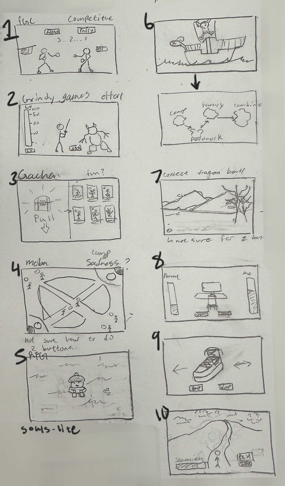

# RPS BattleZ

### [link to code](https://glitch.com/edit/#!/cpsc-581-project-1-rps?path=button_handling.js%3A26%3A2)

## Overall Description
Our project revolves around a two-button game that mirrors my passion for fighting games and competitive spirit. Drawing inspiration from my love for fighting games and the thrill of competitive games, we designed a game based on the traditional "Rock, Paper, Scissors" concept but with a creative twist that reflects my interests.

The game includes three main actions: Attack, Parry, and Block, each corresponding to familiar fighting game moves. These interactions go beyond the standard RPS format, incorporating fighting game strategy, where each move  counters another. This variation adds depth and strategy, capturing the excitement of fast-paced decisions in competitive gameplay. The game's inspiration comes from iconic Street fighter 3, adding nostalgic elements that speak to my fondness for the Street Fighter series.

With two simple buttons, players can make decisions that impact the battle between two on-screen characters. The design intentionally reflects the classic arcade era, featuring a sleek yet nostalgic aesthetic to make the experience both engaging and visually captivating. The simplicity of the controls, paired with the rich visual and strategic depth, creates a game that's both fun and challenging, embodying the spirit of the competitive gaming I love.

## Concept sketches

  

1. Fighting game featuring two actions: attack and block, functioning as a rock-paper-scissors mechanics.
2. Auto battler where players click to attack monsters, gaining experience points to level up.
3. Gacha game that allows players to create and draw cards from a rarity-based pool.
4. MOBA-like battle arena game.
5. Souls-lite dungeon battler where players can move and attack incoming monsters.
6. Island traversal game where players explore islands, each representing different aspects of their personality or life.
7. Treasure hunt game where users click to find hidden dragon balls on a map.
8. Happiness management game where players balance parental expectations of studying with their enjoyment of gaming.
9. Shoe discovery game where users swipe right for shoes they like and left for those they dislike.
10. Stamina management game where users hike up a mountain while managing their stamina.

## Refined Sketches 

  
    
    
  

Each sketch represents the conceptual development of my RPS (Rock-Paper-Scissors) game, which was my initial idea for Assignment 1. The refined sketch evolved from this concept, allowing me to ideate different gameplay mechanics and designs.

I chose to refine this idea because it aligns with my passion for fighting games and competitive play, making it a natural fit for my project. These sketches showcase the progression from the initial idea to the more developed final version.

Ultimately, my application meets the assignment's objectives by reflecting my interests in gaming and competition, resulting in an engaging experience.

    
  

  
  
  

These refined sketches were derived from concept ideas 2 and 3. Instead of having separate buttons for attacking and leveling up, I decided to consolidate the actions into one button for attacking and blocking, allowing leveling up to occur as a natural result of battles. This approach enhances the gameplay experience.

Additionally, I envisioned combining the auto battler and gacha game concepts, where players summon rare cards—each with its own rarity—to fight monsters. However, I encountered challenges regarding the game's complexity and its connection to my personality. While I enjoy gacha and hunting games, I struggled to find a deeper personal connection beyond my love for these genres.

