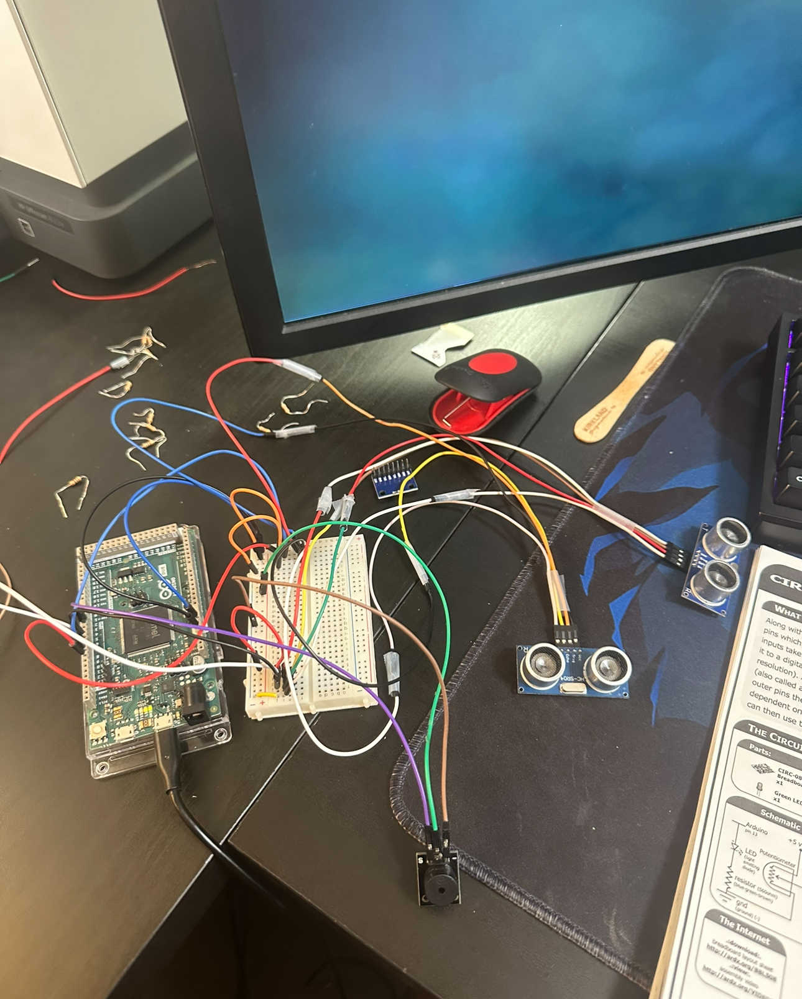

# Musical Canvas 

### [link to code]()

## Overall Description
Musical Canvas is an innovative instrument that allows artists and musicians to add a unique soundtrack to their creations. Using two ultrasonic sensors, the system maps specific musical notes from the pentatonic scale to different paint choices. This setup enables even those without musical backgrounds to create harmonious music as they paint.

As the artist selects different paints, each color triggers a corresponding note, enriching the creative process. The second ultrasonic sensor detects when the artist is actively painting, causing the selected notes to play in real-time, based on the chosen colors. Once the artwork is complete, the system plays back the sequence of notes used, creating a unique musical composition that accompanies the visual piece.
## Project Documentation 
### How Does it Work?
1. Paint and Sound Mapping:
The project uses two ultrasonic sensors. The first sensor is responsible for detecting the "paint" or color selected by the user. Each color is mapped to a specific note from the pentatonic scale (A, C, D, E, G).
As the user selects a paint color, the corresponding note is assigned to that color. The pentatonic scale was chosen to ensure even those with no musical experience can create harmonious and pleasant sounds.

2. Painting Detection and Note Playback:
The second ultrasonic sensor detects when the user is actively painting. When the user brings their brush or hand within range of this sensor, the system begins playing the assigned note for the selected paint color.
As the user paints with different colors, the system dynamically changes the notes based on the current selection, creating real-time sound corresponding to their artistic actions.

3. Post-Painting Playback (was not able to implement this):
After the user completes their artwork, the system will play back the sequence of notes in the order they were used during the painting process. This creates a unique musical composition that reflects the creation of the artwork, adding an audio dimension to the visual experience.

## Initial idea to final iteration

  
    
  

  
  

### Circuit Schematic Diagram

### Demo Video 

  <iframe width="560" height="315" src="https://www.youtube.com/embed/pOdP_8pd2zY" 
  title="YouTube video player" frameborder="0" allow="accelerometer; autoplay; clipboard-write; encrypted-media; gyroscope; picture-in-picture" allowfullscreen>
  </iframe>

## Project Contribution
