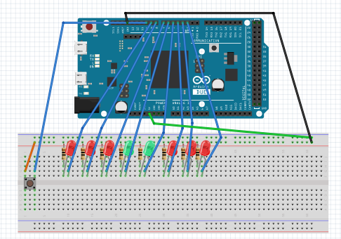
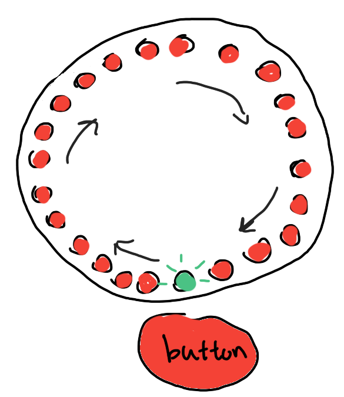
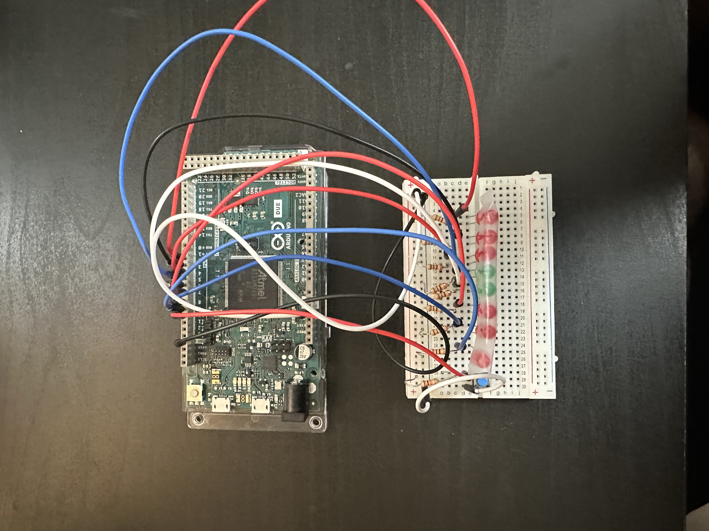
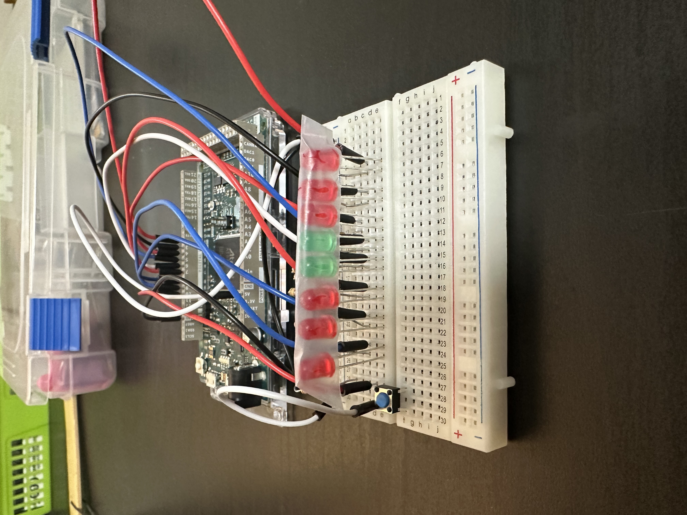
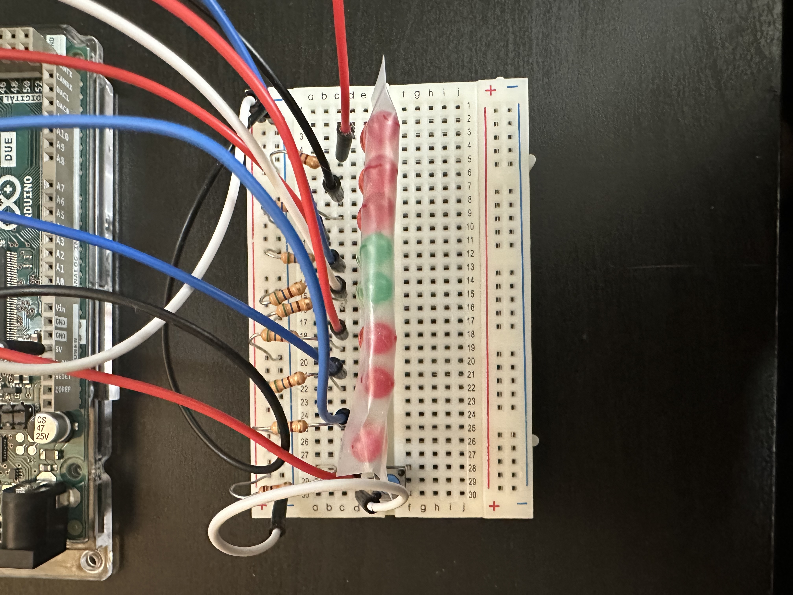
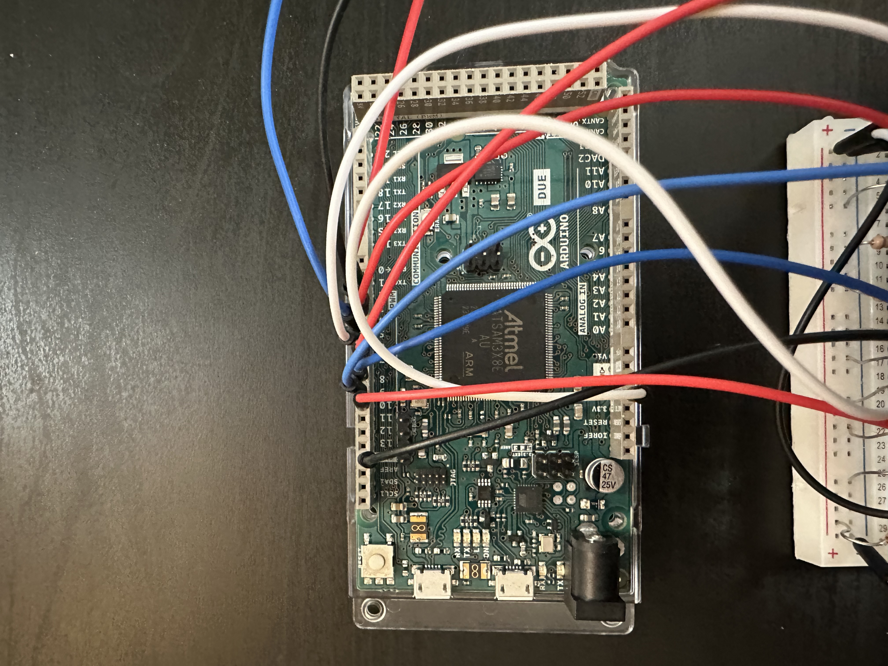

# RPS BattleZ

## [link to code](https://glitch.com/edit/#!/cpsc-581-project-1-rps?path=button_handling.js%3A26%3A2)

### Overall Description

## Concept sketches

### How Does it Work?
1. LED Sequence:
There are 8 LEDs in total: two green LEDs at positions 3 and 4, and six red LEDs at the left-right ends.
The LEDs light up sequentially, starting from the first red LED and moving toward the LED at the other end.
When the sequence reaches the end, it reverses direction, bouncing back to the first red LED.
Only one LED is lit at a time, and the previous one turns off when the next LED lights up.

2. Player Input:
The player must press the button when either green LED is lit.
If the player presses the button when a green LED is on, they win. The green LED will blink as a reward, and the game will speed up.
If the player presses the button when a red LED is lit, they lose. The red LED will blink, and the game resets after a short pause.

3. Speed Mechanism:
The game starts with a moderate speed and increases after each win by reducing the delay between LED transitions.
The speed caps at a certain level to prevent the game from becoming impossible.

### Demo Video 

  <iframe width="560" height="315" src="https://www.youtube.com/embed/pOdP_8pd2zY" 
  title="YouTube video player" frameborder="0" allow="accelerometer; autoplay; clipboard-write; encrypted-media; gyroscope; picture-in-picture" allowfullscreen>
  </iframe>

### Circuit Schematic Diagram

  

## Initial idea to final iteration

  

  
  

  
  

## Reference 
[ARDX open Source Arduino instruction guide ](https://oomlout.com/a/products/ardx/) - Was used for code and circuit setup 
